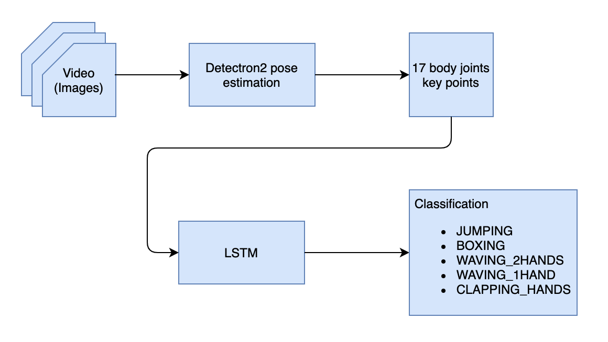
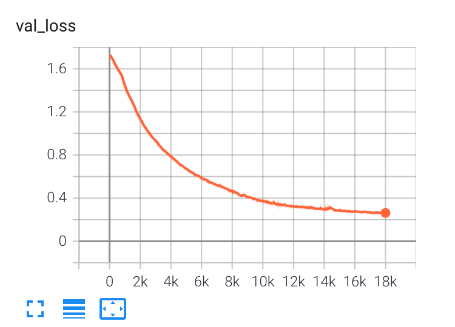
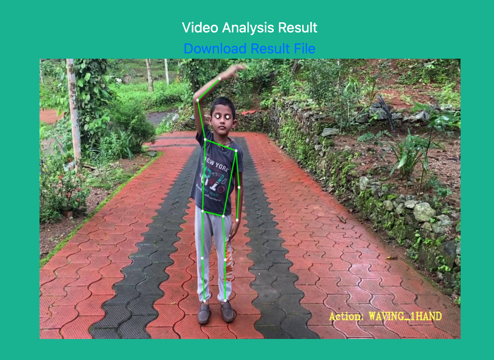
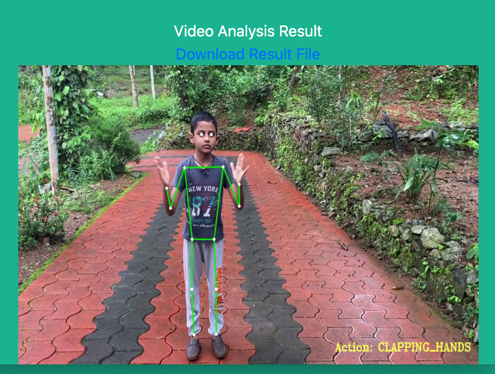

# Human action classification using 2D pose estimation and LSTM

Action classification is an interesting problem to solve in computer vision domain and have its application in various fields.

In this blog post, we are going to describe how we can use 2D pose estimation along with LSTM to classify human actions in a video. 

Our model architecture <br/>

<br/>

As shown above, our architecture has two parts - 
1. Video input is fed into a 2D pose estimation model to produce a sequence of body parts key points.
2. Output of pose estimation is fed into a LSTM model for action classification

## Code base
Checkout this code to run the application and see it in action - https://github.com/bibinss/human-action-classification-using-detectron-and-lstm

## 2D Pose estimation

There are several approaches to pose estimation and the one we are using here is [Detectron2](https://github.com/facebookresearch/detectron2/) library. Detectron2 is a widely popular library from Facebook AI Research (FAIR) 
which provides solutions to various computer vision problems like object detection, pose estimation, segmentation ... etc.
We are using the pretrained model "R50-FPN" from [model zoo](https://github.com/facebookresearch/detectron2/blob/master/MODEL_ZOO.md#coco-person-keypoint-detection-baselines-with-keypoint-r-cnn). This model is trained on COCO data set and outputs 17 key points as body parts joints.

We use a sliding window approach to action classification. Pose estimation is performed on a window size of 32 continous frames and the out put is fed into LSTM.


## LSTM (Long Short-term Memory)

LSTM is a type of RNN (Recurrent Neural Network) model. We have defined our own LSTM model based on pytorch library.

```
class ActionClassificationLSTM(pl.LightningModule):
    def __init__(self, input_features, hidden_dim, learning_rate=0.001):
        super().__init__()
        self.save_hyperparameters()
        self.lstm = nn.LSTM(input_features, hidden_dim, batch_first=True)
        self.linear = nn.Linear(hidden_dim, 6)

    def forward(self, x):
        lstm_out, (ht, ct) = self.lstm(x)
        return self.linear(ht[-1])
```

## Training

We have trained our own LSTM model from data set given under https://github.com/stuarteiffert/RNN-for-Human-Activity-Recognition-using-2D-Pose-Input

Since we are using Detectron2 for pose estimation, we have retrofitted the dataset to map to Detectron2 output format for training our LSTM model. (Original dataset was created using [OpenPose](https://github.com/CMU-Perceptual-Computing-Lab/openpose) library which output 18 keypoints (or more) per human from the input image while Detectron2 produces only 17 keypoints)

Model classifies the action into 6 categories
- JUMPING
- JUMPING_JACKS
- BOXING
- WAVING_2HANDS
- WAVING_1HAND
- CLAPPING_HANDS

Speciality about this app is that we are using pytorch libraries for both Pose Detection and LSTM. Detectron2 is written using pytorch. Our LSTM model is also built using pytorch and is trained uning pytorch-lightining. pytorch-lightning makes the training code very easy and concise.

We have trained our LSTM model and have saved the best model for inferencing. 

<table><tr><td>
Validation Loss <br/>

</td>
<td>
Validation Accuracy <br/>

</td></tr></table>

## Inferencing
We have built an Flask based web application to run the Detectron and LSTM models in colab to process input videos. Use the [colab notebooks](https://github.com/bibinss/human-action-classification-using-detectron-and-lstm#colab-notebooks) mentioned in the codebase to run the application. 

Below shows some results of application for the sample video provided. Action classification performed by the application is updated on the result video. See it on the below images on the bottom right of the images.
<table><tr><td>

</td>
<td>

</td></tr></table>